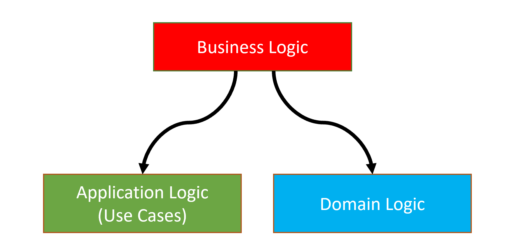
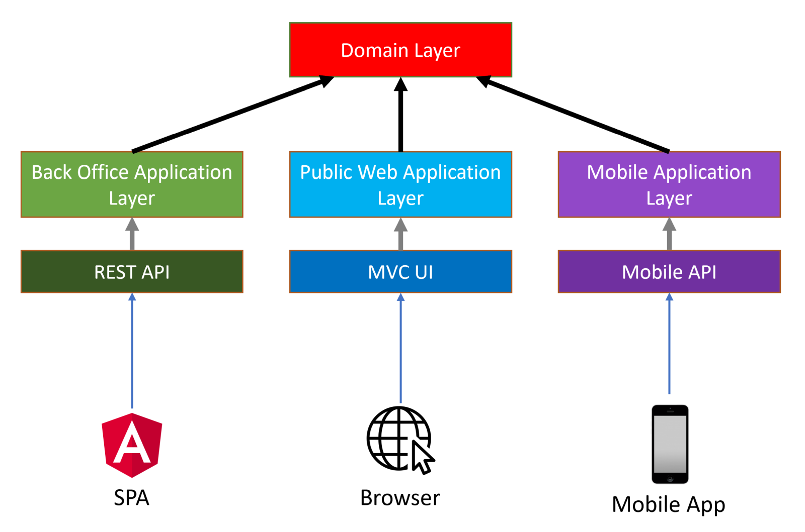

## Domain Logic & Application Logic

As mentioned before, *Business Logic* in the Domain Driven Design is spitted into two parts (layers): *Domain Logic* and *Application Logic*:



Domain Logic consists of the *Core Domain Rules* of the system while Application Logic implements application specific *Use Cases*.

While the definition is clear, the implementation may not be easy. You may be undecided which code should stand in the Application Layer, which code should be in the Domain Layer.  This section tries to explain the differences.

### Multiple Application Layers

DDD helps to **deal with complexity** when your system is large. Especially, if there are **multiple applications**  are being developed in a **single domain,** then the **Domain Logic vs Application Logic separation** becomes much more important.

Assume that you are building a system that has multiple applications;

* A **Public Web Site Application**, built with ASP.NET Core MVC, to show your products to users. Such a web site doesn't require authentication to see the products. The users login to the web site, only if they are performing some actions (like adding a product to the basket).
* A **Back Office Application**, built with Angular UI (that uses REST APIs). This application used by office workers of the company to manage the system (like editing product descriptions).
* A **Mobile Application** that has much simpler UI compared to the Public Web Site. It may communicate to the server via REST APIs or another technology (like TCP sockets).



Every application will have different **requirements**, different **use cases** (Application Service methods), different **DTOs**, different **validation** and **authorization** rules... etc.

Mixing all these logics into a single application layer makes your services contain too many `if` conditions with **complicated business logic** makes your code **harder to develop, maintain and test** and leads to potential bugs.

If you've multiple applications with a single domain;

* Create **separate application layers** for each application/client type and implement application specific business logic in these separate layers.
* Use a **single domain layer** to share the core domain logic.

Such a design makes it even more important to distinguish between Domain logic and Application Logic.

To be more clear about the implementation, you can create different projects (`.csproj`) for each application types. For example;

* `IssueTracker.Admin.Application` & `IssueTracker.Admin.Application.Contacts` projects for the Back Office (admin) Application.
* `IssueTracker.Public.Application` & `IssueTracker.Public.Application.Contracts` projects for the Public Web Application.
* `IssueTracker.Mobile.Application` & `IssueTracker.Mobile.Application.Contracts` projects for the Mobile Application.

### Examples

This section contains some Application Service and Domain Service examples to discuss how to decide to place business logic inside these services.

**Example: Creating a new `Organization` in a Domain Service**

````csharp
public class OrganizationManager : DomainService
{
    private readonly IRepository<Organization> _organizationRepository;
    private readonly ICurrentUser _currentUser;
    private readonly IAuthorizationService _authorizationService;
    private readonly IEmailSender _emailSender;

    public OrganizationManager(
        IRepository<Organization> organizationRepository, 
        ICurrentUser currentUser, 
        IAuthorizationService authorizationService, 
        IEmailSender emailSender)
    {
        _organizationRepository = organizationRepository;
        _currentUser = currentUser;
        _authorizationService = authorizationService;
        _emailSender = emailSender;
    }

    public async Task<Organization> CreateAsync(string name)
    {
        if (await _organizationRepository.AnyAsync(x => x.Name == name))
        {
            throw new BusinessException("IssueTracking:DuplicateOrganizationName");
        }

        await _authorizationService.CheckAsync("OrganizationCreationPermission");

        Logger.LogDebug($"Creating organization {name} by {_currentUser.UserName}");

        var organization = new Organization();

        await _emailSender.SendAsync(
            "systemadmin@issuetracking.com",
            "New Organization",
            "A new organization created with name: " + name
        );

        return organization;
    }
}
````

Let's see the `CreateAsync` method step by step to discuss if the code part should be in the Domain Service, or not;

* **CORRECT**: It first checks for **duplicate organization name** and and throws exception in this case. This is something related to core domain rule and we never allow duplicated names.
* **WRONG**: Domain Services should not perform **authorization**. [Authorization](Authorization.md) should be done in the Application Layer.
* **WRONG**: It logs a message with including the [Current User](CurrentUser.md)'s `UserName`. Domain service should not be depend on the Current User. Domain Services should be usable even if there is no user in the system. Current User (Session) should be a Presentation/Application Layer related concept.
* **WRONG**: It sends an [email](Emailing.md) about this new organization creation. We think this is also a use case specific business logic. You may want to create different type of emails in different use cases or don't need to send emails in some cases.

**Example: Creating a new `Organization` in an Application Service**

````csharp
public class OrganizationAppService : ApplicationService
{
    private readonly OrganizationManager _organizationManager;
    private readonly IPaymentService _paymentService;
    private readonly IEmailSender _emailSender;

    public OrganizationAppService(
        OrganizationManager organizationManager,
        IPaymentService paymentService, 
        IEmailSender emailSender)
    {
        _organizationManager = organizationManager;
        _paymentService = paymentService;
        _emailSender = emailSender;
    }

    [UnitOfWork]
    [Authorize("OrganizationCreationPermission")]
    public async Task<Organization> CreateAsync(CreateOrganizationDto input)
    {
        await _paymentService.ChargeAsync(
            CurrentUser.Id,
            GetOrganizationPrice()
        );

        var organization = await _organizationManager.CreateAsync(input.Name);
        
        await _organizationManager.InsertAsync(organization);

        await _emailSender.SendAsync(
            "systemadmin@issuetracking.com",
            "New Organization",
            "A new organization created with name: " + input.Name
        );

        return organization; // !!!
    }

    private double GetOrganizationPrice()
    {
        return 42; //Gets from somewhere else...
    }
}
````

Let's see the `CreateAsync` method step by step to discuss if the code part should be in the Application Service, or not;

* **CORRECT**: Application Service methods should be unit of work (transactional). ABP's [Unit Of Work](Unit-Of-Work.md) system makes this automatic (even without need to add `[UnitOfWork]` attribute for the Application Services).
* **CORRECT**: [Authorization](Authorization.md) should be done in the application layer. Here, it is done by using the `[Authorize]` attribute.
* **CORRECT**: Payment (an infrastructure service) is called to charge money for this operation (Creating an Organization is a paid service in our business).
* **CORRECT**: Application Service method is responsible to save changes to the database.
* **CORRECT**: We can send [email](Emailing.md) as a notification to the system admin.
* **WRONG**: Do not return entities from the Application Services. Return a DTO instead.

**Discussion: Why don't we move the payment logic into the domain service?**

You may wonder why the payment code is not inside the `OrganizationManager`. It is an **important thing** and we never want to **miss the payment**.

However, **being important is not sufficient** to consider a code as a Core Business Logic. We may have **other use cases** where we don't charge money to create a new Organization. Examples;

* An admin user can use a Back Office Application to create a new organization without any payment.
* A background-working data import/integration/synchronization system may also need to create organizations without any payment operation.

As you see, **payment is not a necessary operation to create a valid organization**. It is a use-case specific application logic.

**Example: CRUD Operations**

````csharp
public class IssueAppService
{
    private readonly IssueManager _issueManager;

    public IssueAppService(IssueManager issueManager)
    {
        _issueManager = issueManager;
    }

    public async Task<IssueDto> GetAsync(Guid id)
    {
        return await _issueManager.GetAsync(id);
    }

    public async Task CreateAsync(IssueCreationDto input)
    {
        await _issueManager.CreateAsync(input);
    }

    public async Task UpdateAsync(UpdateIssueDto input)
    {
        await _issueManager.UpdateAsync(input);
    }

    public async Task DeleteAsync(Guid id)
    {
        await _issueManager.DeleteAsync(id);
    }
}
````

This Application Service **does nothing** itself and **delegates all the work** to the *Domain Service*. It even passes the DTOs to the `IssueManager`.

* **Do not** create Domain Service methods just for simple **CRUD** operations **without any domain logic**.
* **Never** pass **DTOs** to or return **DTOs** from the Domain Services.

Application Services can directly work with repositories to query, create, update or delete data unless there are some domain logics should be performed during these operations. In such cases, create Domain Service methods, but only for those really necessary.

> Do not create such CRUD domain service methods just by thinking that they may be needed in the future ([YAGNI](https://en.wikipedia.org/wiki/You_aren%27t_gonna_need_it))! Do it when you need and refactor the existing code. Since the Application Layer gracefully abstracts the Domain Layer, the refactoring process doesn't effect the UI Layer and other clients.

[Introduction](Introduction.md) | [Next part: Reference Books](ReferenceBooks.md)